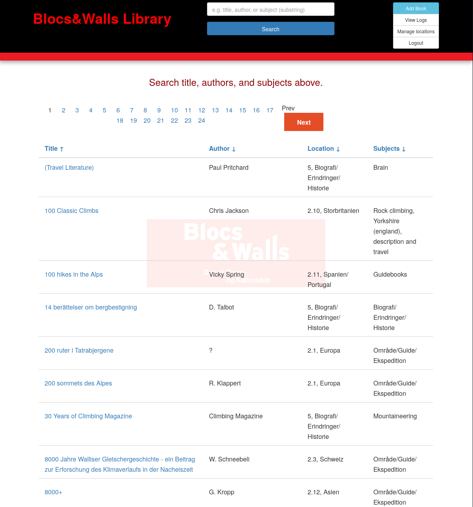

This is a simple app to show the location of books for small libraries.

You can add/edit/delete book entries and upload pdf files.



## Get it running
Remember to copy `library.cfg_EXAMPLE` to `library.cfg` and change env variables as needed.

Initialize the database 
``` sh
export FLASK_APP=controller.py

# Initialize the migrations folder (only needed once)
flask db init
# Create the initial migration
flask db migrate -m "Initial migration"
# Apply the migration to create the database
flask db upgrade
```
This will create a `./migrations` folder and generate the database schema in `./database/books.sqlite` 

To restart with an empty database, simply delete the sql-file and rerun the migration

``` sh
rm ./src/database/books.sqlite
flask db upgrade
```

Uploaded files will be stored in `./uploads`

Run the app

``` sh
nix develop -c $SHELL

python src/controller.py
```

or  (fish shell)
``` sh
set -x FLASK_APP src/controller.py; set -x FLASK_DEBUG 1; python3 -m flask run --host 0.0.0.0
```

Then after you log in
- Add locations (ie shelf-numbers or whatever you use)
- add books

### docker
The `database` and `uploads` directories and `library.cfg` should be mounted into the docker image.

Steps to build a tagged image and run it
``` sh
docker build -t library .
docker run -d --restart=always --name=dbkk-library -p 80:5000 \
  -v "$(pwd)/database:/app/database" \
  -v "$(pwd)/uploads:/app/uploads" \
  -v "$(pwd)/library.cfg:/app/library.cfg" \
  library
```

Verify the mounted volumes

``` sh
docker exec -it <container_id> bash
ls -l /app/
```


With `--restart=always` there is no need for a [systemd-service file](https://stackoverflow.com/a/30450350).

When pulling new code, the image have to rebuild and the container deleted(stooped and recreated)
``` sh
docker build -t library .
docker rm dbkk-library
```

The old image will still exist locally, but `docker images` will show <none> as its name or tag. `docker system prune` will clean up the old image.

If the container just runs a one-off test, you might delete the old container before building a new image, or use the `docker run --rm` option to have the container delete itself. add `--entrypoint bash` to get a shell if the app is crashing and the container exists, which prevents `docker exec bash` from working.

``` sh
docker run --rm -it -e FLASK_DEBUG=1 -p 5000:5000 library
docker run --rm -it -e FLASK_DEBUG=1 -p 5000:5000 --entrypoint bash library
```

`docker run` creates and start a new container. `docker start` start an already existing container.

#### Debug

``` sh
docker ps
docker exec -it <container_id> sh -c "apt update && apt install -y net-tools"
docker exec -it <container_id> netstat -tulnp
```

Or check that a webpage is reachable inside the container

``` sh
docker exec -it <container_id> sh -c "apt update && apt install -y curl"
docker exec -it <container_id> curl -v http://127.0.0.1:5000
```

#### NixOS

Build the docker image on NixOS with
``` sh
nix build .#dockerImage
docker load < result

docker run -p 5000:5000 \
  -v $(pwd)/uploads:/app/uploads \
  -v $(pwd)/database:/app/database \
  -v "$(pwd)/library.cfg:/app/library.cfg" \
  library:latest
  ```
### docker-compose

`docker-compose` mounts the code into the container so code-changes are automatically seen by the app.
``` sh
docker-compose up -d  # or for production
podman-compose --podman-run-args='--replace' up --build
docker-compose up -d -f docker-compose.prod.yml
```

go to [localhost:5000] (http://localhost:5000) in the browser


### Amazon ec2 instance

``` sh
ssh ec2-user@ec2-ip-address-dns-name-here

sudo yum install docker git
sudo systemctl enable docker.service
sudo systemctl start docker.service

# add user to docker group
sudo usermod -a -G docker ec2-user
id ec2-user
# logout

git clone https://github.com/pawsen/library-org.git
```


### NixOS
Running this on a NixOS server requires 
- A NixOS module for the Flask app.
- A server configuration that uses the module.
- A flake to manage dependencies and build the system.

## Maintainance
### database migration

If the database is changed, like adding a new model

``` python
class TransactionLog(db.Model):
    id = db.Column(db.Integer, primary_key=True)
    timestamp = db.Column(db.DateTime, default=db.func.current_timestamp())  # Auto-timestamp
    action = db.Column(db.String(50), nullable=False)  # "ADD", "EDIT", "DELETE"
    book_id = db.Column(db.Integer, db.ForeignKey("book.id"), nullable=True)  # Reference the book
    book_title = db.Column(db.String(200))  # Store the title at the time of change
    details = db.Column(db.Text)  # Store what changed
```

The database is updated with

``` sh
flask db migrate -m "Add transaction log"
flask db upgrade
```


## Backups

Use cron to schedule the backup script to run automatically.

- Open the crontab editor
``` sh
crontab -e
```
- Add a cron job to run the backup script daily at e.g. 2 AM:

``` sh
0 2 * * * /path/to/backup.sh >> /var/log/dbkk-library-backup.log 2>&1
```

## Similar projects
This is a rewrite of https://github.com/noisebridge/library-org
See also https://www.noisebridge.net/wiki/Resources/Library . Noisebrridge is a HackerSpace in the US.

### Circulation
https://github.com/not7cd/circulation
python3, using flask. This app allows users to borrow books. Could replace library-org with time

See the db models:
https://github.com/not7cd/circulation/blob/master/circulation/models.py


### LibraryThing
https://www.librarything.com/

Free Online catalog where users can create their own collections. Locations can be stored as `tags`
## misc
### Convert logo; reduce size and give it opacity
451x means a with of 451pixel, keeping aspect ratio. Thus x451 is height of 451 pixel.

``` sh
convert logo.jpg -alpha set -channel A -evaluate set 10% -resize 451x logo_opacity.png
```

The background logo is `./static/dist/images/Nb_2169_sticker-10p-opacity.png` This is set in ``./src/static/dist/main.css`

### Converting the old DBKK mdb to sqlite
I made a script to convert the old mdb into a sqlite db. The script used the book details to scrape https://openlibrary.org and google-books to get more details.
There is also a script to get info from the ISBN, read by a barcode scanner, populate the db and prompt for the location.

See https://github.com/pawsen/dbkk-library-converter
